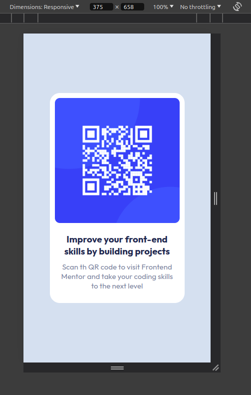

# Frontend Mentor - QR code component solution

This is a solution to the [QR code component challenge on Frontend Mentor](https://www.frontendmentor.io/challenges/qr-code-component-iux_sIO_H). Frontend Mentor challenges help you improve your coding skills by building realistic projects.

## Table of contents

- [Overview]

### Screenshot

#### Desktop View

#### Mobile View

### Links

### Built with

- Semantic HTML5 markup
- CSS custom properties
- Flexbox

### What I learned

I learned to use word-wrap css property and also how overflow property works

## Author

- Frontend Mentor - [@zexez](https://www.frontendmentor.io/profile/git-prakash-raj)
